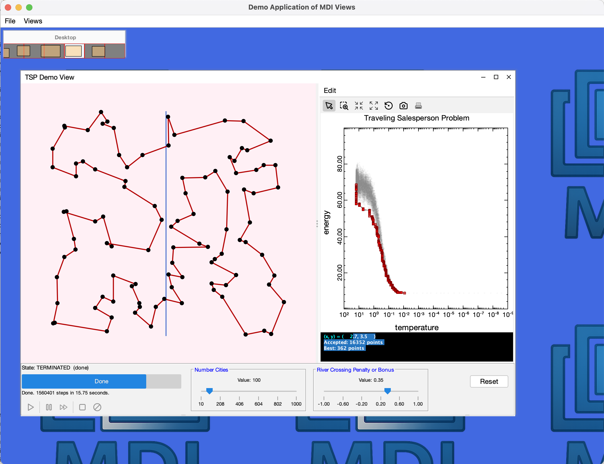

# MDI – Modular Desktop Interface for Scientific Applications


[](https://arxiv.org/abs/2602.21026)


MDI is a Java framework for building scientific desktop applications with:

- Interactive plotting  
- Simulation engines  
- Multi-view modular architecture  
- Extensible tools and layered drawing  
- Distribution via Maven Central  

It is built on pure Swing for long-term JVM stability and zero external runtime dependencies.

---

## Why MDI?

Scientific desktop applications have different needs than typical GUI apps:

- Long-running simulations  
- Real-time data visualization  
- Multi-document workflows  
- Precise rendering control  
- Stability across Java versions  

MDI provides architectural infrastructure for these use cases.

It is not just a widget toolkit.  
It is a foundation for building complete scientific applications.

---

## Key Features

### Multi-Document Architecture

Each window (“view”) operates independently while sharing:

- Messaging infrastructure  
- Common models  
- Simulation engine integration  
- Extensible toolbars  
- Layered drawing support  

---

### Integrated Plotting (splot)

The built-in plotting module provides:

- Thread-safe curve updates  
- Swing EDT-safe rendering  
- Curve fitting  
- Lock-free staging queues for background updates  
- Coalesced repaint events  

Plots can safely receive data from worker threads without repaint storms.

---

### Built-In Simulation Framework

MDI includes:

- Step-based simulation engines  
- Cancel support  
- Reset hooks  
- Coordinated view refresh  
- Background execution integration  

Ideal for:

- Physics demonstrations  
- Optimization visualizations  
- Network simulations  
- Educational tools  

---

### Layered Drawing System

Views support:

- Items  
- Layers  
- Mouse interaction  
- Selection tools  
- Virtual desktop behavior  

This makes it easy to build:

- Network graphs  
- Geometric editors  
- Data overlays  
- Interactive teaching tools  

---

## Installation

MDI is available on Maven Central:

```xml
<dependency>
    <groupId>io.github.heddle</groupId>
    <artifactId>mdi</artifactId>
    <version>1.0.0</version>
</dependency>
```
---

## Hello MDI

The following minimal example creates an MDI application with a single `DrawingView`:


This example demonstrates:

- Creating an MDI application by extending `BaseMDIApplication`
- Configuring a `DrawingView` using key–value properties
- Adding initial content once the virtual desktop is ready

```java

public class HelloMDI extends BaseMDIApplication {

	private final DrawingView drawingView; //only view

	public HelloMDI(Object... keyVals) {
		super(keyVals);
		// set to a fraction of screen
		Dimension d = WindowPlacement.screenFraction(0.4);
		
		// specify (bitwise) what will be on the toolbar
		long toolBits = ToolBits.STATUS | ToolBits.DRAWINGTOOLS | ToolBits.ZOOMTOOLS | ToolBits.PAN;
		
		drawingView = new DrawingView(
				PropertyUtils.WORLDSYSTEM, new Rectangle2D.Double(0, 0, d.width, d.height),
				PropertyUtils.WIDTH, d.width,
				PropertyUtils.HEIGHT, d.height,
				PropertyUtils.TOOLBARBITS, toolBits,
				PropertyUtils.VISIBLE, true,
				PropertyUtils.BACKGROUND, Color.white,
				PropertyUtils.INFOBUTTON, true,
				PropertyUtils.TITLE,"Drawing View");
	}
	
    // Runs once after the outer frame is showing and Swing layout has stabilized.
	@Override
	protected void onVirtualDesktopReady() {
		// desktop ready, safe to apply default placements and add content.
		drawingView.center();

		//lets add some initial content to the drawing view
		Layer layer = drawingView.getContainer().getAnnotationLayer();
		CreationSupport.createRectangleItem(layer, new Rectangle(50, 50, 100, 100));
	}

	// Main method to launch the application.
	public static void main(String[] args) {
	    BaseMDIApplication.launch(() ->
	        new HelloMDI(
	            PropertyUtils.TITLE, "Hello MDI",
	            PropertyUtils.FRACTION, 0.8
	        )
	    );
	}
}
```
---

## Demo Application

The repository includes a full-featured `DemoApp` showcasing:

- DrawingView
- PlotView (splot integration)
- Network layout demo
- Traveling Salesperson simulation
- 2D map view
- Simulation framework examples

To run the demo from the project source:

```bash
mvn clean package
mvn exec:java -Dexec.mainClass="edu.cnu.mdi.demo.DemoApp"
```
Here is one of the views running inside the DemoApp:


